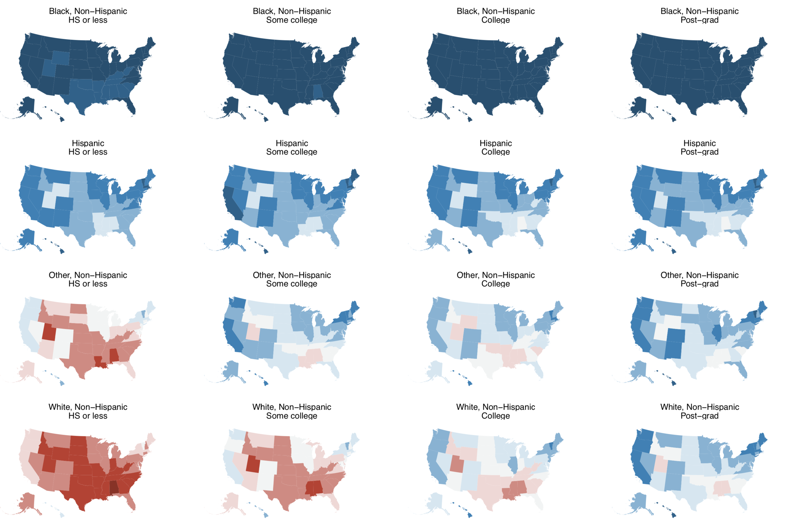
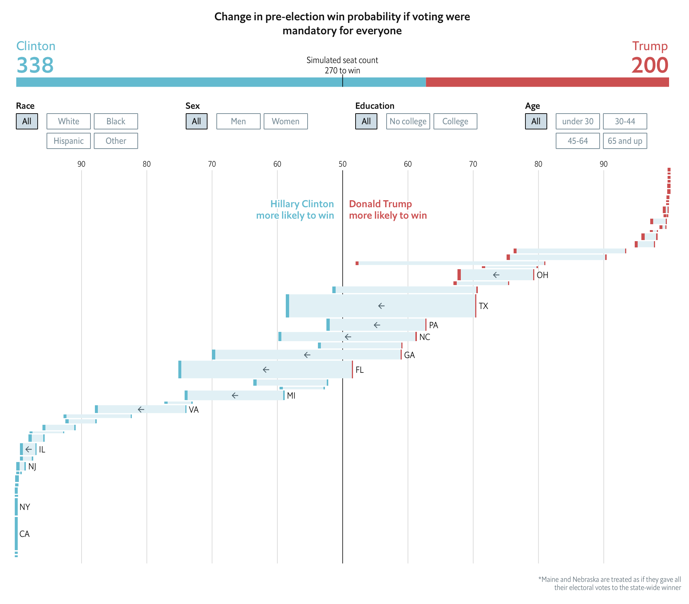

```{r include=F}
# NOTE: EXPORT TO PDF WITH pagedown::chrome_print("index.Rmd")

library(tidyverse)
library(knitr)
library(kableExtra)

knitr::opts_chunk$set(echo=F,warning=F,message=F,
                      eval = TRUE)

```

class: center, inverse

# &nbsp;
# &nbsp;
# What is a "data journalist"?
# &nbsp;
# &nbsp;

---
# What is a "data journalist"?

A "data journalist" is just like a "regular" journalist who relies on their own skills in empiricism to tell a story.

## Process:
--

### 1. Find a story

--

### 2. Find a data-driven angle in said story

--

### 3. Analyze data with statistics programs (Excel, STATA, Python, R)

--

### 4. Convey information (with words and graphics)


---

class: center, inverse

# &nbsp;
# &nbsp;
# What if everyone voted?
# &nbsp;
# &nbsp;

---

# Guiding questions

--

## 1. How many Democrats and Republicans are there?

Given data constraints, we're really asking: How many Clinton and Trump voters are there?

--

### 2. How are they distributed geographically?

The answer lets us assign Electoral College votes.

---

# Data

--

## 1. Cooperative Congressional Election Study (CCES): A survey of 64,000 Americans

Includes demographic data and 2016 vote choice for 40,000+ validated voters

--

## 2. American Community Survey (ACS): A Census Bureau survey of 175,000 Americans

Includes the same demographic data as the CCES
32,640 “cells”

---

# Method

--

## 1. Train a predictive model on CCES data

- Multi-level logistic regression
- Predict vote choice with: age, gender, race, education, region and interactions between them

--

## 2. Use the model to predict voting habits for every eligible American

Via “post-stratification” on the ACS

---

# ACS Post-stratification

--

### 1. Each "type" of person gets their own "cell":
  - One cell for white men ages 18-30 without college degrees who live in the Northeast
  - Another for white men ages 18-30 without college degrees who live in the South
  - Another for non-white men ages 18-30 without college degrees who live in the Northeast
  - etc.

--

### 2. We know how many voters in that "cell" live in each state

--

### 3. So we can say that x and y% of each "cell" vote for Clinton or Trump, then add up
  - For example, a Latino female age 18-30 with a college degree in Texas is 85% likely to vote for a Democrat for president (White man 65+ is 80% Republican)


---

# Results

```{r}

```


---

# Results

```{r}
knitr::include_graphics('figures/votes_bystate.png')
```


---

# Results: If everyone voted

```{r out.width='80%'}

```


---

class: center, inverse

# &nbsp;
# &nbsp;
# What does this tell us about voter suppression?
# &nbsp;
# &nbsp;

---

# Voter suppression

--

### - We can modify the percentage of each group that turns out to vote, then re-predict the election
  - What if only all whites vote?
  - All non-whites?
  - Whites without degrees? Etc.

--

### - Democrats do better when non-whites turnout; Republicans have a vested interest in keeping turnout rates low
  - Especially in southern states with large minority populations
  - Their efforts to move voting locations off-campus—TX almost removed the FAC as a precinct after 2018—also have political consequences


---

# Suppression of white votes

```{r out.width='80%'}

```


---

# Suppression of non-white votes

```{r out.width='80%'}


```
---

# Considerations

## What this doesn’t tell us:
-  That Clinton/Trump/Abrams/etc would have won if certain x, y or z  restrictions had been put in place
- Downstream effects (AKA party positions and coalition changes)

## The balancing act:
 - There are a ton of white, non-college educated voters in the Midwest that tilt national scales if we increase turnout
  - Especially because increases in turnout are not uniform
  - And because of their geographic distribution, small relative increases in white turnout can tip the Electoral College to Republicans (see: 2016)
  - But on the other hand, some organizations are explicitly targeting non-whites and young voters for turnout purposes


---

class: center

# Thank you!

&nbsp;

## G. Elliott Morris
### Data journalist, _The Economist_

**Email: [elliott@thecrosstab.com](mailto:elliott@thecrosstab.com)**

**Twitter: [@gelliottmorris](http://www.twitter.com/gelliottmorris)**

<br> 
--- 

_These slides were made with the `xaringan` package for R from Yihui Xie. They are available online at https://www.thecrosstab.com/slides/2019-09-30-utaustin/_
