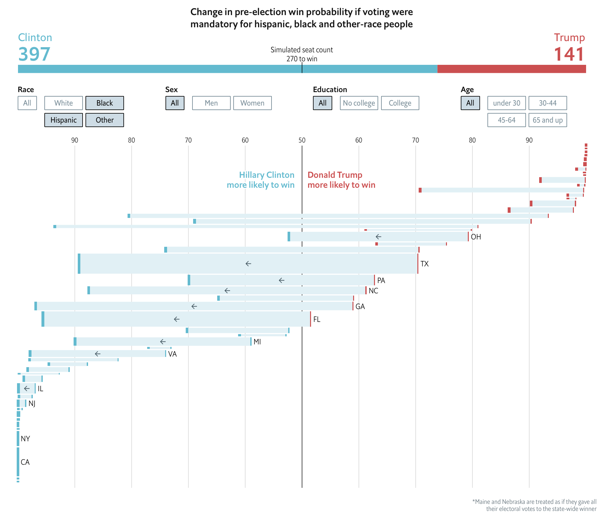
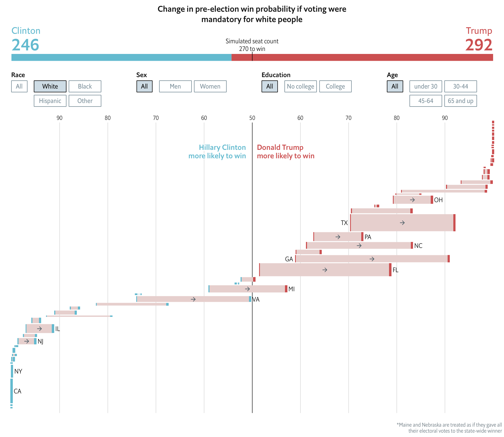
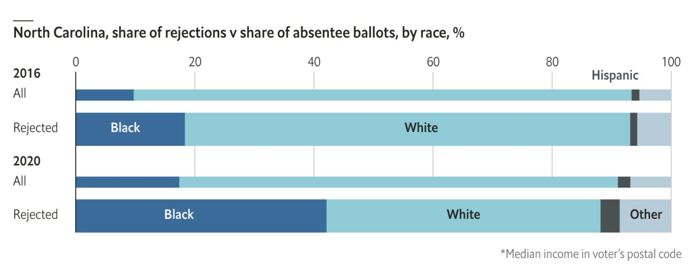
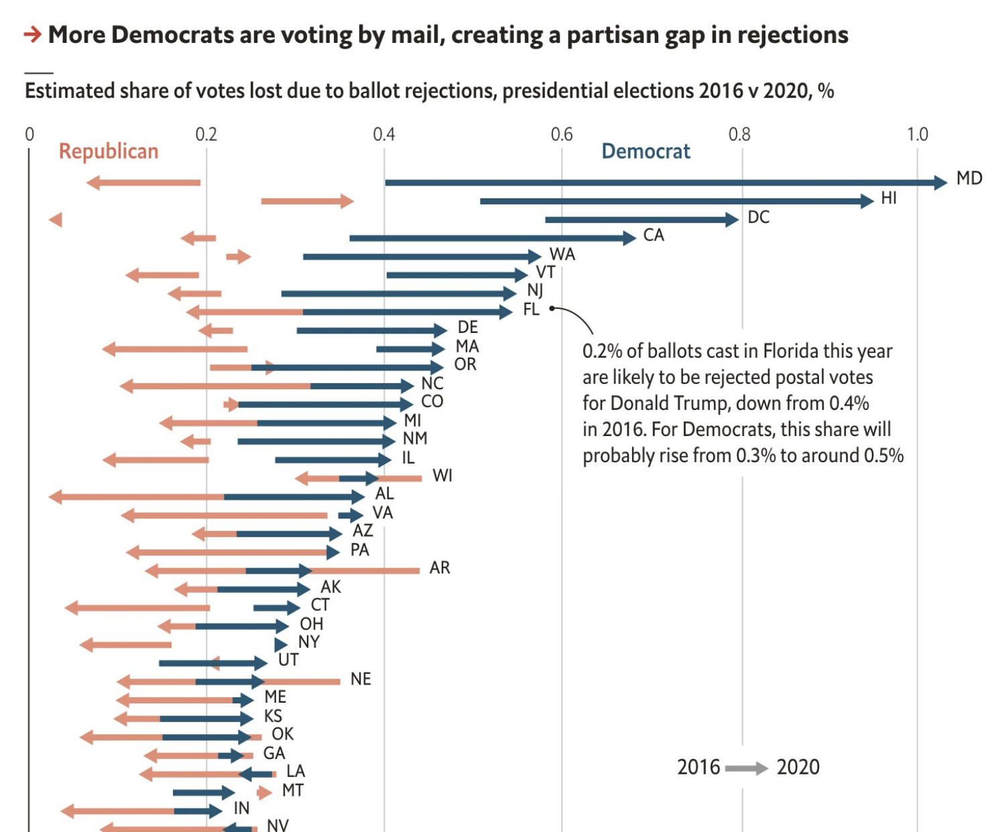

```{r include=F}
# NOTE: EXPORT TO HTML WITH: pressing the knit button
# NOTE: EXPORT TO PDF WITH pagedown::chrome_print("index.Rmd")
# keep updating with xaringan::infinite_moon_reader()

library(knitr)

knitr::opts_chunk$set(echo=F,warning=F,message=F,
                      eval=TRUE)

library(xaringanthemer)


title_background_color = '#e3120b'
title_text_color = '#fafafa'

inverse_background_color = '#8abbd0'
inverse_text_color = '#fafafa'

header_color = '#0000'
background_color = "#fafafa"

style_xaringan(
  text_color = "#000",
  header_color = "#000",
  background_color = "#FFF",
  link_color = "#8abbd0",
  text_bold_color = NULL,
  text_slide_number_color = inverse_background_color,
  padding = "16px 64px 16px 64px",
  background_image = NULL,
  background_size = NULL,
  background_position = NULL,
  code_highlight_color = "rgba(255,255,0,0.5)",
  code_inline_color = "#000",
  code_inline_background_color = NULL,
  code_inline_font_size = "1em",
  inverse_background_color = inverse_background_color,
  inverse_text_color = inverse_text_color,
  inverse_text_shadow = FALSE,
  inverse_header_color = "#f3f3f3",
  title_slide_text_color = title_text_color,
  title_slide_background_color = title_background_color,
  title_slide_background_image = NULL,
  title_slide_background_size = NULL,
  title_slide_background_position = NULL,
  footnote_color = NULL,
  footnote_font_size = "0.9em",
  footnote_position_bottom = "60px",
  left_column_subtle_color = "#777",
  left_column_selected_color = "#000",
  blockquote_left_border_color = "lightgray",
  table_border_color = "#666",
  table_row_border_color = "#ddd",
  table_row_even_background_color = "#eee",
  base_font_size = "20px",
  text_font_size = "1rem",
  header_h1_font_size = "2.75rem",
  header_h2_font_size = "2.25rem",
  header_h3_font_size = "1.75rem",
  header_background_auto = FALSE,
  header_background_color = header_color,
  header_background_text_color = background_color,
  header_background_padding = NULL,
  header_background_content_padding_top = "7rem",
  header_background_ignore_classes = c("normal", "inverse", "title", "middle",
    "bottom"),
  text_slide_number_font_size = "0.9em",
  text_font_google = google_font('Merriweather'),
  text_font_family = xaringanthemer_font_default("header_font_family"),
  text_font_weight = xaringanthemer_font_default("text_font_weight"),
  text_font_url = xaringanthemer_font_default("text_font_url"),
  text_font_family_fallback = xaringanthemer_font_default("text_font_family_fallback"),
  text_font_base = "sans-serif",
  header_font_google = google_font('Merriweather'),
  header_font_family = xaringanthemer_font_default("header_font_family"),
  header_font_weight = xaringanthemer_font_default("header_font_weight"),
  header_font_url = xaringanthemer_font_default("header_font_url"),
  code_font_google = google_font('Roboto'),
  code_font_family = xaringanthemer_font_default("code_font_family"),
  code_font_size = "0.9rem",
  code_font_url = xaringanthemer_font_default("code_font_url"),
  code_font_family_fallback = xaringanthemer_font_default("code_font_family_fallback"),
  colors = NULL,
  extra_css = NULL,
  extra_fonts = NULL,
  outfile = "custom-xaringan-theme.css"
)


```


class: center, inverse, middle

# What if everyone voted?

---

# Guiding questions

--

## 1. How many Democrats and Republicans are there?

Given data constraints, we're really asking: How many Clinton and Trump voters are there?

--

### 2. How are they distributed geographically?

The answer lets us assign Electoral College votes.

---

# Data

--

## 1. Cooperative Congressional Election Study (CCES): A survey of 64,000 Americans

Includes demographic data and 2016 vote choice for 40,000+ validated voters

--

## 2. American Community Survey (ACS): A Census Bureau survey of 175,000 Americans

Includes the same demographic data as the CCES
32,640 “cells”

---

# Method

--

## 1. Train a predictive model on CCES data

- Multi-level logistic regression
- Predict vote choice with: age, gender, race, education, region and interactions between them

--

## 2. Use the model to predict voting habits for every eligible American

Via “post-stratification” on the ACS

---

# ACS Post-stratification

--

### 1. Each "cell" (row) is one "type" of person
  - One cell for white men ages 18-30 without college degrees who live in the Northeast
  - Another for white men ages 18-30 without college degrees who live in the South
  - Another for non-white men ages 18-30 without college degrees who live in the Northeast
  - etc.

--

### 2. We know how many voters in that "cell" live in each state

--

### 3. So we can say that x and y% of each "cell" vote for Clinton or Trump, then add up
  - For example, a Latino female age 18-30 with a college degree in Texas is 85% likely to vote for a Democrat for president (White man 65+ is 80% Republican)


---

# Results

```{r}
knitr::include_graphics('figures/states_demography.png')
```


---

# Results

```{r}
knitr::include_graphics('figures/votes_bystate.png')
```


---

# Results: If everyone voted

```{r out.width='80%'}
knitr::include_graphics('figures/everyone_votes.png')
```


---

class: center, inverse, middle

# What does this tell us about voter suppression?

---

# Voter suppression

--

### - We can modify the percentage of each group that turns out to vote, then re-predict the election
  - What if only all whites vote?
  - All non-whites?
  - Whites without degrees? Etc.

--

### - Democrats do better when non-whites turnout; Republicans have a vested interest in keeping turnout rates low
  - Especially in southern states with large minority populations
  - Or on college campuses


---

# Suppression of whites votes

```{r out.width='80%'}

```


---

# Suppression of POC votes

```{r out.width='80%'}


```
---

# Considerations

--

## What this doesn’t tell us:
-  That Clinton/Trump/etc would have won if certain x, y or z  restrictions had been put in place
- Downstream effects (AKA party positions and coalition changes)

--

## The balancing act:
 - There are a ton of white, non-college educated voters in the Midwest that tilt national scales if we increase turnout
  - Especially because increases in turnout are not uniform
  - And because of their geographic distribution, small relative increases in white turnout can tip the Electoral College to Republicans (see: 2016)
  - But on the other hand, some organizations are explicitly targeting non-whites and young voters for turnout purposes


---

class: center, inverse, middle

# Application to 2020


---

# Application to 2020

--

### 1. Use YouGov data and MRP for turnout, vote choice, and vote method

### 2. Train models on NC ballot rejections to predict rejection likelihood

### 3. Calculate vote rejections for all absentee votes

### 4. Tally up lost votes for each party


---

# Model NC rejection rates

```{r out.width='80%'}

```


---

# Calculate partisan impact

```{r out.width='70%'}

```

---

class: center

# Thank you!

<br>
<br>

#### Website: [gelliottmorris.com](https://www.gelliottmorris.com)

#### Email: [elliott@thecrosstab.com](mailto:elliott@thecrosstab.com)

#### Twitter: [@gelliottmorris](http://www.twitter.com/gelliottmorris)

<br>
<br>

<hr>


_These slides were made with the `xaringan` package for R from Yihui Xie. They are available online at https://www.gelliottmorris.com/slides/2020-10-22-ut-austin/_


