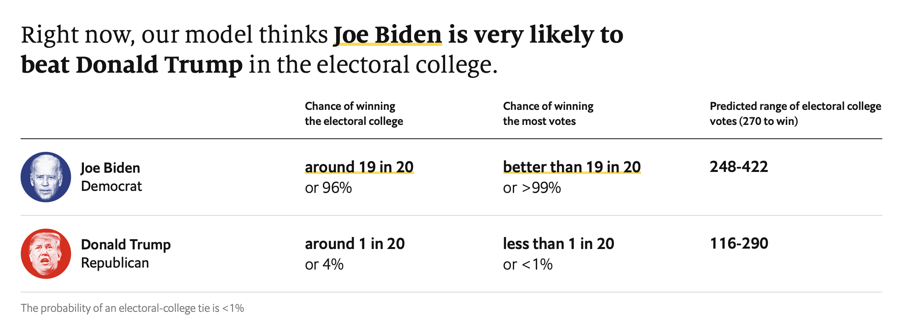
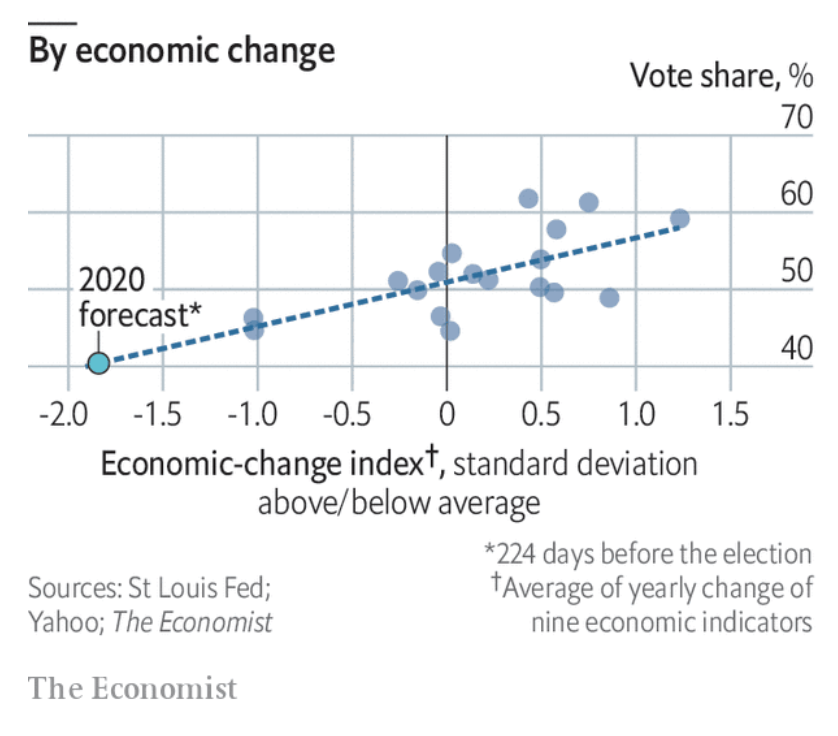
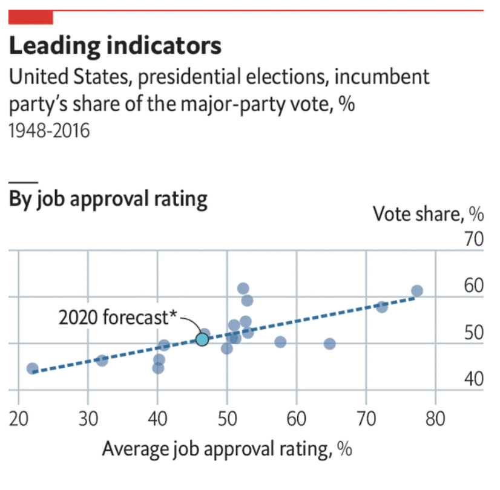
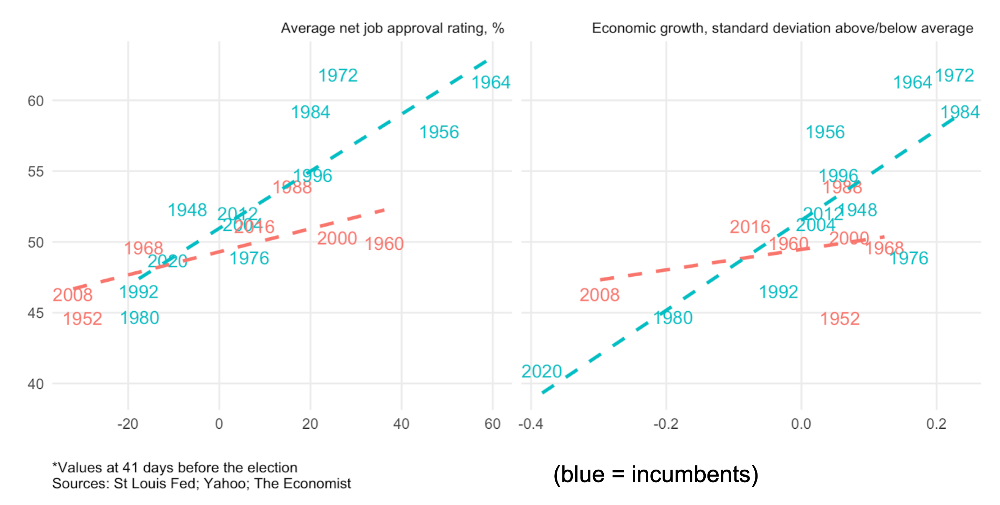
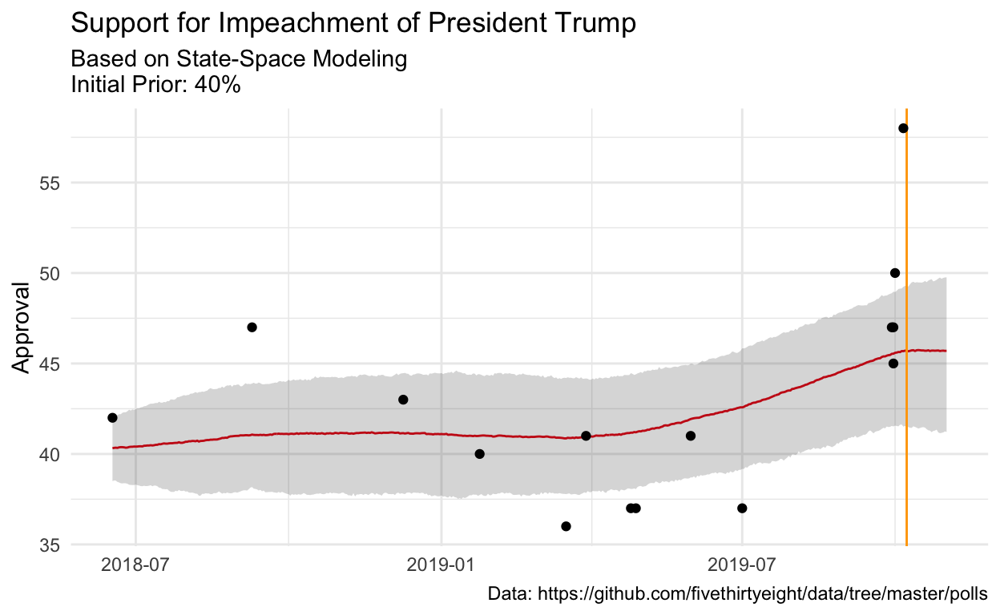
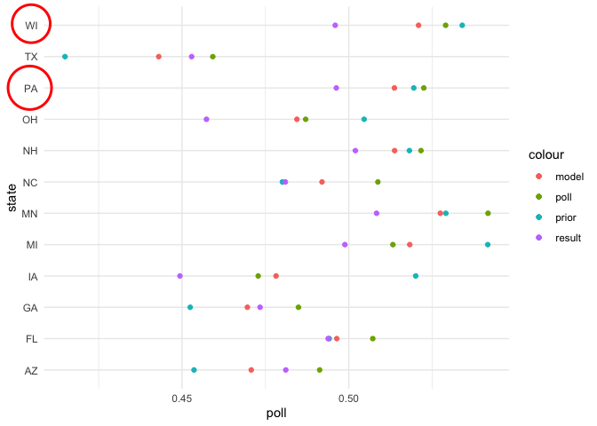
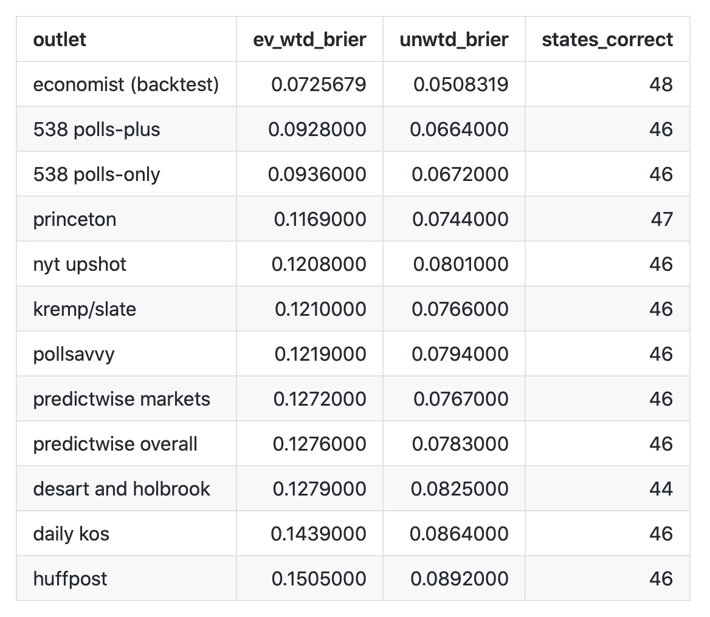
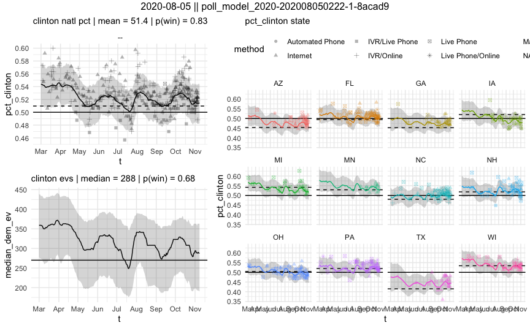
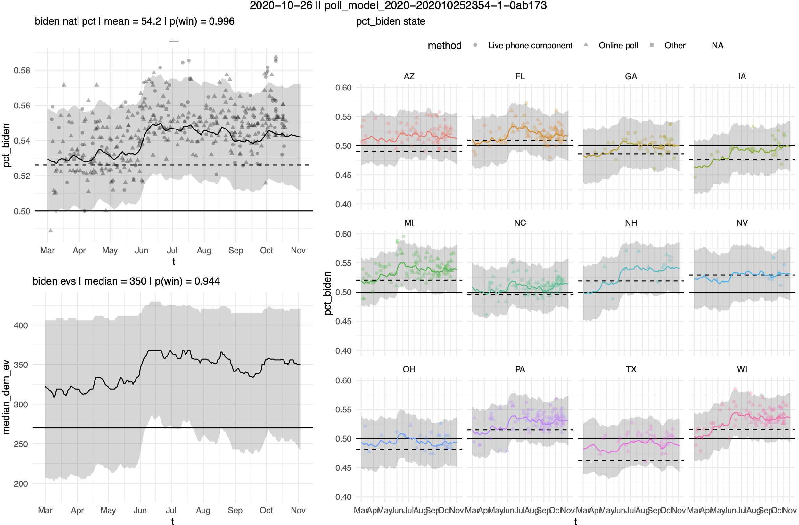

```{r include=F}
# NOTE: EXPORT TO HTML WITH: pressing the knit button
# NOTE: EXPORT TO PDF WITH pagedown::chrome_print("index.Rmd")
# keep updating with xaringan::infinite_moon_reader()

library(knitr)

knitr::opts_chunk$set(echo=F,warning=F,message=F,
                      eval=TRUE)

library(xaringanthemer)


title_background_color = '#e3120b'
title_text_color = '#fafafa'

inverse_background_color = '#8abbd0'
inverse_text_color = '#fafafa'

header_color = '#0000'
background_color = "#fafafa"

style_xaringan(
  text_color = "#000",
  header_color = "#000",
  background_color = "#FFF",
  link_color = "#8abbd0",
  text_bold_color = NULL,
  text_slide_number_color = inverse_background_color,
  padding = "16px 64px 16px 64px",
  background_image = NULL,
  background_size = NULL,
  background_position = NULL,
  code_highlight_color = "rgba(255,255,0,0.5)",
  code_inline_color = "#000",
  code_inline_background_color = NULL,
  code_inline_font_size = "1em",
  inverse_background_color = inverse_background_color,
  inverse_text_color = inverse_text_color,
  inverse_text_shadow = FALSE,
  inverse_header_color = "#f3f3f3",
  title_slide_text_color = title_text_color,
  title_slide_background_color = title_background_color,
  title_slide_background_image = NULL,
  title_slide_background_size = NULL,
  title_slide_background_position = NULL,
  footnote_color = NULL,
  footnote_font_size = "0.9em",
  footnote_position_bottom = "60px",
  left_column_subtle_color = "#777",
  left_column_selected_color = "#000",
  blockquote_left_border_color = "lightgray",
  table_border_color = "#666",
  table_row_border_color = "#ddd",
  table_row_even_background_color = "#eee",
  base_font_size = "20px",
  text_font_size = "1rem",
  header_h1_font_size = "2.75rem",
  header_h2_font_size = "2.25rem",
  header_h3_font_size = "1.75rem",
  header_background_auto = FALSE,
  header_background_color = header_color,
  header_background_text_color = background_color,
  header_background_padding = NULL,
  header_background_content_padding_top = "7rem",
  header_background_ignore_classes = c("normal", "inverse", "title", "middle",
    "bottom"),
  text_slide_number_font_size = "0.9em",
  text_font_google = google_font('Merriweather'),
  text_font_family = xaringanthemer_font_default("header_font_family"),
  text_font_weight = xaringanthemer_font_default("text_font_weight"),
  text_font_url = xaringanthemer_font_default("text_font_url"),
  text_font_family_fallback = xaringanthemer_font_default("text_font_family_fallback"),
  text_font_base = "sans-serif",
  header_font_google = google_font('Merriweather'),
  header_font_family = xaringanthemer_font_default("header_font_family"),
  header_font_weight = xaringanthemer_font_default("header_font_weight"),
  header_font_url = xaringanthemer_font_default("header_font_url"),
  code_font_google = google_font('Roboto'),
  code_font_family = xaringanthemer_font_default("code_font_family"),
  code_font_size = "0.9rem",
  code_font_url = xaringanthemer_font_default("code_font_url"),
  code_font_family_fallback = xaringanthemer_font_default("code_font_family_fallback"),
  colors = NULL,
  extra_css = NULL,
  extra_fonts = NULL,
  outfile = "custom-xaringan-theme.css"
)


```
 

# 2020 presidential election forecast*

<br>

```{r  echo = FALSE, eval = TRUE, out.width = '100%'} 

```

<br>

_*as of October 26 at 12:38 PM_


---

# Our model

### 1. National economic + political fundamentals

### 2. Decompose into state-level priors

### 3. Polls

Uncertainty is propogated throughout the models, incorporated via MCMC sampling in step 3.


---
class: center, inverse, middle

# National Fundamentals


---

# What fundamentals?

#### i) Index of economic growth (1940 - 2016)
- eight different variables, scaled to measure the standard-deviation from average annual growth

#### ii) Presidential approval (1948 - 2016)

#### iii) Polarization (1948 - 2016)
- measured as the share of swing voters in the electorate, per the ANES --- and interacted with economic growth

#### iv) Whether an incumbent is on the ballot


---

```{r  echo = FALSE, eval = TRUE, out.width = '80%'} 

```

---

```{r  echo = FALSE, eval = TRUE, out.width = '80%'} 

```


---

```{r  echo = FALSE, eval = TRUE, out.width = '100%'} 

```


---

# National fundamentals

### Model formula:

vote ~ incumbent_running:economic growth:polarization + approval

### Training

Model trained on 1948-2016 using elastic net regression with leave-one-out cross-validation

```{r  echo = FALSE, eval = TRUE, out.width = '90%'} 
knitr::include_graphics('figures/train-validate-test.png')
```

RMSE = 2.6 percentage points on two-party Democratic vote share


---
class: center, inverse, middle

# State-level prior


---

# State-level prior


#### i) Train a model to predict the Democratic share of the vote in a state relative to the national vote, 1948-2016
* Variables are: lean in the last election, lean two elections ago, home state effects * state size, conditional on the national vote in the state

#### ii) Use the covariates to make predictions for 2020, _conditional on the national fundamentals prediction for every day_

#### ii) Simulate state-level outcomes to extract a mean and standard deviation
* Propogates uncertainty both from the LOOCV RMSE of the national model and the state-level model


---
class: center, inverse, middle

# Pooling the polls


---

# It's just a trend through points...


```{r  echo = FALSE, eval = TRUE, out.width = '90%'} 

```


---

# (...but with some fancy extra stuff)

```
mu_b[:,T] = cholesky_ss_cov_mu_b_T * raw_mu_b_T + mu_b_prior;  
for (i in 1:(T-1)) mu_b[:, T - i] = cholesky_ss_cov_mu_b_walk * raw_mu_b[:, T - i] + mu_b[:, T + 1 - i];
national_mu_b_average = transpose(mu_b) * state_weights;
mu_c = raw_mu_c * sigma_c;
mu_m = raw_mu_m * sigma_m;
mu_pop = raw_mu_pop * sigma_pop;
e_bias[1] = raw_e_bias[1] * sigma_e_bias;
sigma_rho = sqrt(1-square(rho_e_bias)) * sigma_e_bias;
for (t in 2:T) e_bias[t] = mu_e_bias + rho_e_bias * (e_bias[t - 1] - mu_e_bias) + raw_e_bias[t] * sigma_rho;
//*** fill pi_democrat
for (i in 1:N_state_polls){
  logit_pi_democrat_state[i] = 
    mu_b[state[i], day_state[i]] + 
    mu_c[poll_state[i]] + 
    mu_m[poll_mode_state[i]] + 
    mu_pop[poll_pop_state[i]] + 
    unadjusted_state[i] * e_bias[day_state[i]] +
    raw_measure_noise_state[i] * sigma_measure_noise_state + 
    polling_bias[state[i]];
}

```


---

# Poll-level model

--

#### i. Latent state-level vote shares evolve as a random walk over time
* Pooling toward the state-level fundamentals more as we are further out from election day


--

#### ii. Polls are observations with measurement error that are debiased on the basis of:
* Pollster firm (so-called "house effects")
* Poll mode
* Poll population

--

#### iii. Correcting for partisan non-response
* Whether a pollster weights by party registration or past vote
* Incorporated as a residual AR process


---

# Debiased predictions
#### Notable improvements from partisan non-responseand other weighting issues

```{r  echo = FALSE, eval = TRUE, out.width = '80%'} 

```


---

# Debiased predictions
#### Notable improvements from partisan non-responseand other weighting issues

```{r  echo = FALSE, eval = TRUE, out.width = '60%'} 

```


---
class: center, inverse, middle

# Tying it all together


---

# Tying it all together

### 1. 2016 election-day forecast:

```{r  echo = FALSE, eval = TRUE, out.width = '70%'} 

```


---

# Tying it all together

### 2. 2020 forecast*:

```{r  echo = FALSE, eval = TRUE, out.width = '70%'} 

```

_*As of October 26th, 2020_


---
class: center, inverse, middle

# Q&A 


---

class: center

# Thank you!

<br>
<br>

#### Website: [gelliottmorris.com](https://www.gelliottmorris.com)

#### Email: [elliott@thecrosstab.com](mailto:elliott@thecrosstab.com)

#### Twitter: [@gelliottmorris](http://www.twitter.com/gelliottmorris)

<br>
<br>

<hr>


_These slides were made with the `xaringan` package for R from Yihui Xie. They are available online at https://www.gelliottmorris.com/slides/2020-10-23-mit/_


